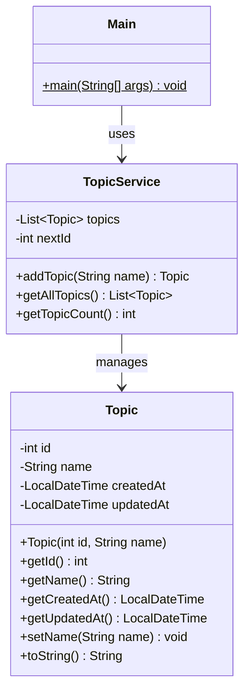
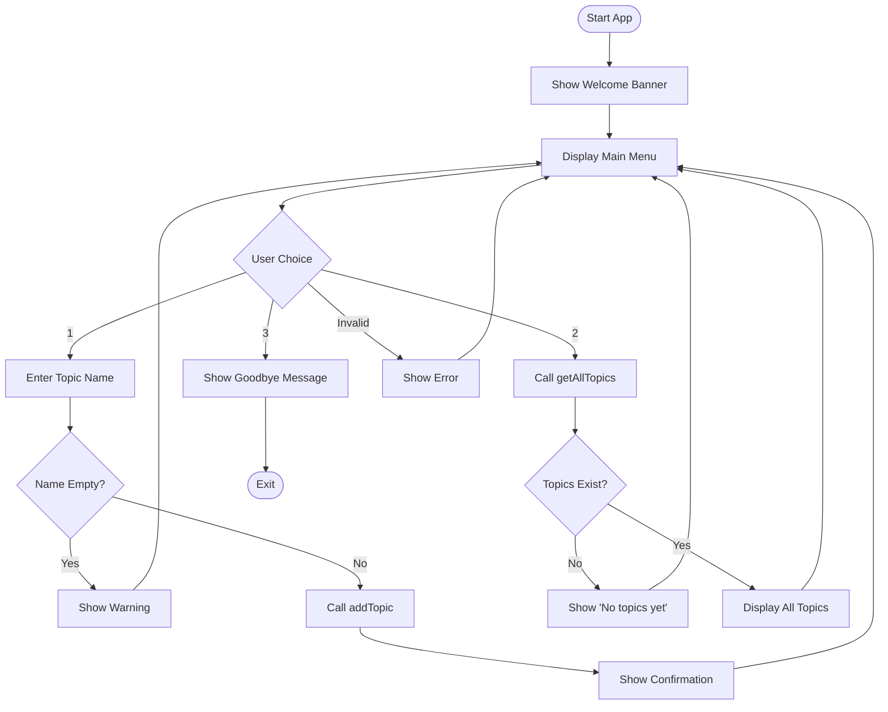
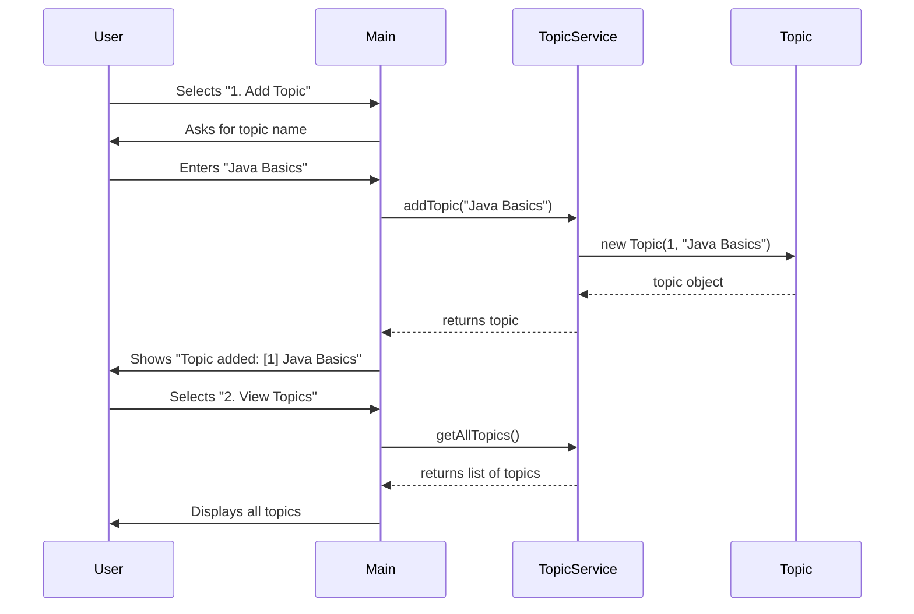

[](https://classroom.github.com/a/mrnvusUx)
# Learning Logs Terminal

### Week 1 — Task 1: Topics

> *"A journey of a thousand lines of code begins with a single class."*

---

## Quest Overview

You are building a **terminal-based Learning Logs application** in Java. This app helps you track the topics you're learning — because the best developers keep learning and keep notes!

Your mission: **complete the TODOs** in the codebase to make the app fully functional.

```
╔══════════════════════════════════════════╗
║     Welcome to Learning Logs Terminal    ║
║     Track what you learn, level up!      ║
╚══════════════════════════════════════════╝

┌──────────────────────────────┐
│         MAIN MENU            │
├──────────────────────────────┤
│  1. Add a new Topic          │
│  2. View all Topics          │
│  3. Exit                     │
└──────────────────────────────┘
Choose an option (1-3):
```

---

## XP System

Earn **XP** by completing each TODO. Collect all **200 XP** to master this quest!

| TODO | Task | XP | File |
|------|------|----|------|
| 1 | Declare Topic fields | 40 XP | `Topic.java` |
| 2 | Create Topic constructor | 20 XP | `Topic.java` |
| 3 | Create getters & setters | 30 XP | `Topic.java` |
| 4 | Override `toString()` | 20 XP | `Topic.java` |
| 5 | Implement `addTopic()` | 30 XP | `TopicService.java` |
| 6 | Implement `getAllTopics()` | 20 XP | `TopicService.java` |
| 7 | Implement `getTopicCount()` | 20 XP | `TopicService.java` |
| **BONUS** | **App runs end-to-end** | **20 XP** | — |
| | **TOTAL** | **200 XP** | |

### Achievement Badges

| Badge | Name | How to Earn |
|-------|------|-------------|
| 🏛️ | **Architect** | Complete all TODOs in `Topic.java` (TODO 1–4) |
| ⚙️ | **Engineer** | Complete all TODOs in `TopicService.java` (TODO 5–7) |
| 🚀 | **Launcher** | App compiles and runs end-to-end |

---

## Project Structure

```
src/main/java/com/learninglogsterminal/
├── Main.java              ← PROVIDED (don't modify)
├── entity/
│   └── Topic.java         ← YOUR WORK (TODO 1–4)
└── service/
    └── TopicService.java  ← YOUR WORK (TODO 5–7)
```

---

## Class Diagram



---

## Application Flow



---

## How It Works — Sequence



---

## Getting Started

### Step 1: Open the Project
Open this project in **IntelliJ IDEA** (or your preferred IDE).

### Step 2: Understand the Code
Read through `Main.java` first — it shows you how the app works and what methods it expects from your code.

### Step 3: Complete the TODOs
Work through the TODOs **in order** (1 → 7). Each TODO has:
- A description of what to do
- A hint to help you

### Step 4: Run the App
Run `Main.java` and test your app!

---

## Expected Output

```
╔══════════════════════════════════════════╗
║     Welcome to Learning Logs Terminal    ║
║     Track what you learn, level up!      ║
╚══════════════════════════════════════════╝

┌──────────────────────────────┐
│         MAIN MENU            │
├──────────────────────────────┤
│  1. Add a new Topic          │
│  2. View all Topics          │
│  3. Exit                     │
└──────────────────────────────┘
Choose an option (1-3): 1
Enter topic name: Java Basics
✓ Topic added: [1] Java Basics (Created: 2026-02-18T10:30:00)
  Total topics: 1

Choose an option (1-3): 1
Enter topic name: OOP Concepts
✓ Topic added: [2] OOP Concepts (Created: 2026-02-18T10:30:15)
  Total topics: 2

Choose an option (1-3): 2

── Your Topics ──────────────────
  [1] Java Basics (Created: 2026-02-18T10:30:00)
  [2] OOP Concepts (Created: 2026-02-18T10:30:15)
─────────────────────────────────
  Total: 2 topic(s)

Choose an option (1-3): 3

Happy Learning! See you next time.
```

---

## Test Cases

Use these to verify your app works correctly:

| # | Action | Input | Expected Result |
|---|--------|-------|-----------------|
| 1 | Add topic | `Java Basics` | Shows `✓ Topic added: [1] Java Basics (Created: ...)` |
| 2 | Add topic | `OOP Concepts` | Shows `✓ Topic added: [2] OOP Concepts (Created: ...)` |
| 3 | View topics | — | Lists both topics with IDs 1 and 2 |
| 4 | Add empty name | *(press enter)* | Shows `⚠ Topic name cannot be empty!` |
| 5 | Invalid option | `5` | Shows `Invalid option. Please choose 1, 2, or 3.` |
| 6 | Exit | `3` | Shows `Happy Learning! See you next time.` |

---

## XP Progress Tracker

Check off each task as you complete it:

- [ ] **TODO 1** — Declare Topic fields (40 XP)
- [ ] **TODO 2** — Create Topic constructor (20 XP)
- [ ] **TODO 3** — Create getters & setters (30 XP)
- [ ] **TODO 4** — Override `toString()` (20 XP)
- [ ] Achievement Unlocked: **🏛️ Architect**
- [ ] **TODO 5** — Implement `addTopic()` (30 XP)
- [ ] **TODO 6** — Implement `getAllTopics()` (20 XP)
- [ ] **TODO 7** — Implement `getTopicCount()` (20 XP)
- [ ] Achievement Unlocked: **⚙️ Engineer**
- [ ] **BONUS** — App runs end-to-end (20 XP)
- [ ] Achievement Unlocked: **🚀 Launcher**

**Your Total: ___ / 200 XP**

---

## Hints & Tips

- `LocalDateTime.now()` gives you the current date and time
- `ArrayList` is a resizable list — use `.add()` to add items, `.size()` for count
- Study `Main.java` carefully — it shows you exactly what methods are called
- Work on `Topic.java` first, then `TopicService.java`
- If you get stuck, read the hint in each TODO comment!

---

*Informatics College Pokhara — Java Programming By Sandesh Hamal*
